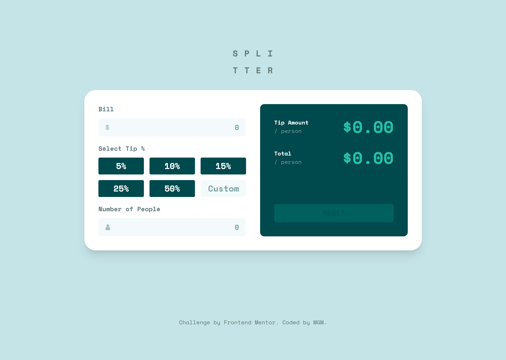

# Frontend Mentor - Tip calculator app solution

This is a solution to the [Tip calculator app challenge on Frontend Mentor](https://www.frontendmentor.io/challenges/tip-calculator-app-ugJNGbJUX). Frontend Mentor challenges help you improve your coding skills by building realistic projects.

## Table of contents

- [Overview](#overview)
  - [Screenshot](#screenshot)
  - [Links](#links)
- [My process](#my-process)
  - [Built with](#built-with)
- [Author](#author)

## Overview
Tip Calculator App

### Screenshot

### Links

- Solution URL: [Solution URL](https://www.frontendmentor.io/solutions/responsive-tip-calculator-app-KvU3KkzH-W)
- Live Site URL: [Github Pages](https://ellamonacillo.github.io/tip-calculator-app.github.io/)

## My Process

### Built with

- HTML5
- JavaScript
- Tailwind CSS

## Author

- Website - [Mariella Monacillo](https://mariellamonacillo.netlify.app)
- Frontend Mentor - [@ellamonacillo](https://www.frontendmentor.io/profile/ellamonacillo)
